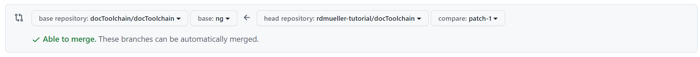

:filename: 025_development/005_contributing_to_docs.adoc
== Contributing to Docs

include::../_feedback.adoc[]

ifndef::imagesdir[:imagesdir: ../images]

:uri-hello-world: https://docs.github.com/en/get-started/quickstart/hello-world
:uri-asciidoc-quick-reference: https://docs.asciidoctor.org/asciidoc/latest/syntax-quick-reference/

The easiest way to contribute to this project is to contribute to the documentation.

Here is a quick step-by-step guide on how to fix something on a documentation page.

=== Prerequisites

* You need a github.com account.
** If you don't have one, you can create one here: https://github.com/signup
* It might help if you go through the {uri-hello-world}[Github Hello World tutorial] before you continue but it is not necessary.

=== Go to page you want to edit or fix

You already found this tutorial, so you already know how to go to the page you want to edit or fix.
All documentation can be found at http://doctoolchain.org/ .
The source code of each page is available at `https://github.com/doctoolchain/doctoolchain/` in the `/src/docs/` folder.
But there is an easier way to find the exact source.

The documentation pages all look something like this:

image::manual/contribute-docs/full-docs-page.png[]

In the upper right corner you can see the _Improve this doc_ link:

image::manual/contribute-docs/improve-this-doc.png[]

This will take you directly to the source of the page, already in edit mode.
If you are not logged in, GitHub will ask you to do so.

The _Create an issue_ link will be helpful if you want to report a bug or request a feature for a page.
It takes you directly to the issue tracker with a pre-filled issue.

For now, let's click on the _Improve this doc_ link.

=== Fork the Repository

If you click the link for the first time, you will be asked to fork the repository.

image::manual/contribute-docs/create-fork.png[]

A fork is a copy of the repository.
Maybe you are used to working on the main repository or a branch within the main repository.
This is not possible in this case, because you don't have write access, only read access.

The solution is to fork the repository.
This way, you create a copy in your own space, and you will have write access to it.

[plantuml,create-fork-diag,png]
----
[comp]
database main
database fork
main -> fork: create fork
note top of main : doctoolchain/doctoolchain
note bottom of fork : <your name>/doctoolchain
remove @unlinked
----

=== Edit the Page

You will now be taken to the page you want to edit already in edit mode.

image::manual/contribute-docs/editor.png[]

What you see is asciidoctor markup.
Check out the {url-asciidoc-quick-reference}[AsciiDoc quick reference] for more information.

The blue box on top tells you what you already know: a copy has been created for you and you are editing it.

IMPORTANT: since you work on your own copy of the docs, you can't break anything.
You even don't have write access to the main repository.
So feel free to edit the page as you like.

Use the _Preview_ button to see what your edits will look like.
Since this is only a preview and GitHub doesn't know about docToolchain, this preview will only show you if your AsciiDoc syntax is correct.
Some other features like the _TOC_ or ``include`` statements will not be available in the preview.

image::manual/contribute-docs/preview.png[]

Do your edit and then

=== Commit the Changes

Below the editor, there is a small _Propose Changes_ form.

image::../images/manual/contribute-docs/propose-changes.png[]

Enter a headline and a description of the changes you made and click _Propose changes_.

This will save your changes to your fork of the repository.

[plantuml,create-fork-diag,png]
----
[comp]
database main
database fork
file page.adoc as page
main -> fork: 1) create fork
fork -> page : 2) edit page
page -> fork : 3) propose changes
note top of main : doctoolchain/doctoolchain
note bottom of fork : <your name>/doctoolchain
remove @unlinked
----

NOTE: Git works with diffs - it only saves the changes you made, not a full copy of the new page.
This is important to know if you want to understand the inner workings of Git.

After you've clicked the button, you will be taken to a page which shows you what you changed.

=== Comparing changes

This view lets you review your changes.

image::manual/contribute-docs/comparing-changes.png[]

These diffs are not easy to read, but I promise that over time you get used to it.

Red lines are deletions, green lines are additions.
As you can see in the screenshot, I added an empty space in line 17.
Line 17 has been deleted (red line) and replaced with a new line (green line).

Line 1 looks mysterious, because it seems that is has been replaced with an identical copy.
This is because the line ending changed but is not visible in the diff.

The grey box on top shows you

It is quite likely that you still know what you did a minute ago, so let's click on the _Create pull request_ button.

